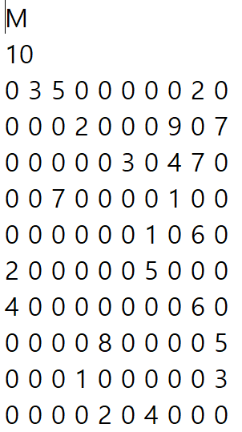
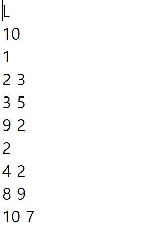

# Graph_searching_and_Shortest_path_algorithm
### There may be errors when running in a Windows or other environment so LINUX environment is recommended. <br/> (Work Environment : Ubuntu 18.04)

- This project implemented graph searching algorithms and finding shortest path.\
Implemented algorithms : **BFS, DFS, Kruskal, Dijkstra, Bellman Ford, Floyd**\
Graph data will be saved as text file named `graph_M.txt` or `graph_L.txt`.\
If the file starts with 'M', it means that I will use **matrix** formed data.\
If the file starts with 'L', user will use **list** form.\
Each data format must fit with following conditions.

- `graph_M.txt` saves data in matrix form \
First line of file must start with **M** and this is the only contents in first line.\
It means, to be a adequate data, first line is only entered **M**.\
Next line is number of nodes, and this one is only entered number.\
Starting from the 3rd line, the weight for each node is entered as many nodes as the second line.\
Each line must contain as many numbers as the number of nodes entered, separated by space characters.\
The row represents the departure, and the column is the destination.\
Diagonal term must be 0 because it is weight of vertex itself.\
The image below is an example of a file.\
&emsp;&emsp;&emsp;&emsp;&emsp;&emsp;&emsp;&emsp;&emsp;&emsp;
<br/><br/>
- `graph_L.txt` saves in list form.\
You should enter only **L** in first line.\
Next line is number of nodes.\
In this file, you have two options, entering only a vertex number or entering vertex numaber and weight.\
If you only enter a vertex number, you should enter destination vertex and weight of between these two nodes from next line.\
See the chart below for the data formats and image below is an example.
    <table>
        <tr>
            <th> number of entered numbers </th>
            <th> description </th>
        </tr>
        <tr>
            <td> &emsp;&emsp;&emsp;&emsp;&emsp;&emsp; 1 </td>
            <td> Entered number is departure vertex number. </td>
        </tr>
        <tr>
            <td> &emsp;&emsp;&emsp;&emsp;&emsp;&emsp; 2 </td>
            <td> First one : Destination vertex number<br/>
                 Second one : Weitght between departure & destination. </td>
        </tr>
    </table>

&emsp;&emsp;&emsp;&emsp;&emsp;&emsp;&emsp;&emsp;&emsp;&emsp;&emsp;&emsp;&emsp;
<br/><br/>
- Program commands are those, `LOAD`, `PRINT`, `BFS`, `DFS`, `KRUSKAL`, `DIJKSTRA`, `BELLMANFORD`, `FLOYD` and `EXIT`.\
Each commands are explained in following table.

    <table>
        <tr>
            <th colspan='4'> <h2>Command Workout</h2></td>
        </tr>
        <tr>
            <th> Command </td>
            <th> Work </td>
            <th> Error code </td>
            <th> Example </td>
        </tr>
        <tr>
            <td> LOAD </td>
            <td> 1. Load data from text file. You should enter two type of graph data, 
                graph_L.txt or graph_M.txt.<br/>
                2. Save graph from the file.<br/>
                &emsp;If graph_L is entered, graph is saved as linked list, otherwise it will be saved as 2D array.
            </td>
            <td> 100 </td>
            <td> LOAD graph_L.txt<br/>
            or<br/>
            LOAD graph_M.txt </td>
        </tr>
        <tr>
            <td> PRINT </td>
            <td> Prints the saved graph.<br/>
            If it is saved in matrix, print it as matrix form.<br/>
            Otherwise, on each line, output the neighboring vertices from the starting vertex, <br/>along with the weights between them.
            Format is like this.<br/>
            &emsp;[departure node] -> (destination, weight) -> (destination, weight) -> ....
            </td>
            <td> 200 </td>
            <td> PRINT </td>
        </tr>
        <tr>
            <td> BFS </td>
            <td> Do BFS and print its result.<br/>
                You should enter two options, directional and start vertex.
                <br/>They must be in this order and all the option is seperated with blank.<br/>
                Enter directional option right after 'BFS '.<br/>
                if you want consider direction, enter 'Y', if not, 'N' <br/>
            </td>
            <td> 300 </td>
            <td> BFS Y 3 <br/> or <br/> BFS N 1 </td>
        </tr>
        <tr>
            <td> DFS </td>
            <td> Do DFS and print its result. <br/> Command options are same with BFS.</td>
            <td> 400 </td>
            <td> DFS Y 3 <br/> or <br/> DFS N 1 </td>
        </tr>
        <tr>
            <td> KRUSKAL </td>
            <td> Find Minimum Spanning Tree, MST, from the graph and print edges in ascending order by weight.
            </td>
            <td> 500 </td>
            <td> KRUSKAL </td>
        </tr>
        <tr>
            <td> DIJKSTRA </td>
            <td> Do Dijkstra and print its result. Command options are same with BFS.<br>
            Printing format is as follow.<br/>
            [From vertex]&emsp;&emsp;Destination(weight)<br/>
            If there's unreachable node, print 'x' instead of destination and its weight.
            </td>
            <td> 600 </td>
            <td> DIJKSTRA Y 0 <br/>or<br/> DIJKSTRA N 1
            </td>
        </tr>
        <tr>
            <td> BELLMANFORD </td>
            <td> Do Bellmanford and print its result.<br/>
            Command options are three, directional, start vertex and destination.<br/>
            Print all vertices visited and final cost. If there's unreachable node, print 'x'</td>
            <td> 700 </td>
            <td>  BELLMANFORD Y 2 9
            </td>
        </tr>
        <tr>
            <td> FLOYD </td>
            <td> Do Floyd considering directional option and print its result. If there's unreachable node, print 'x'</td>
            <td> 800 </td>
            <td> FLOYD </td>
        </tr>
        <tr>
            <td> EXIT </td>
            <td> Free the program from memory and terminate the program. </td>
            <td> &nbsp;&nbsp; - </td>
            <td> EXIT </td>
        </tr>
        <tr>
            <td> Command error </td>
            <td> Wrong command is entered. </td>
            <td> 1000 </td>
            <td> </td>
        </tr>
    </table>

- Cautions for executing code are following.
    ```
    1. Graph data is neccessary so you should execute 'LOAD' command first before you run the other commands.
    2. If you enter wrong vertex number, it'll occurs error code. Check your graph and number of vertecies.
    3. Command options must include just like example's format of each command.
    ```
- After run this program, log file `log.txt` is remained and there are results of each command.
- Run following codes when you run this program. Current directory must be the root directory of this project.
    ``` bash
    make
    ./run
    ```

Reference : https://github.com/Jiseok-Yang/2023_Kwangwoon_Univ_CE_DS_Project_3